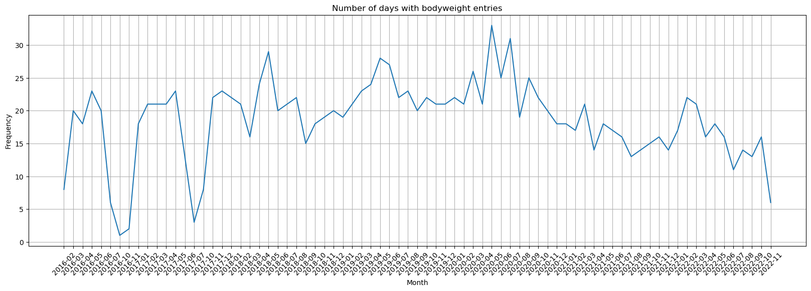
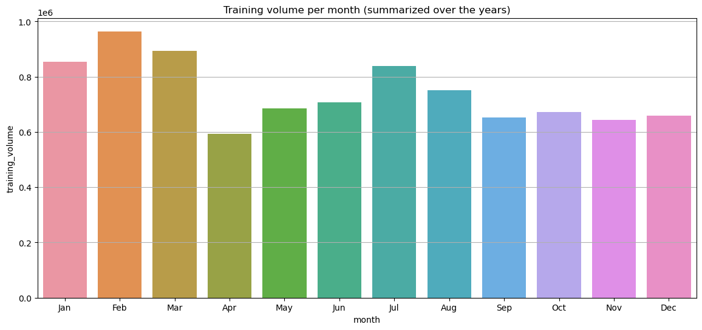
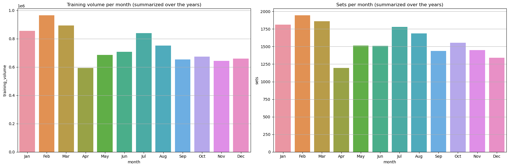
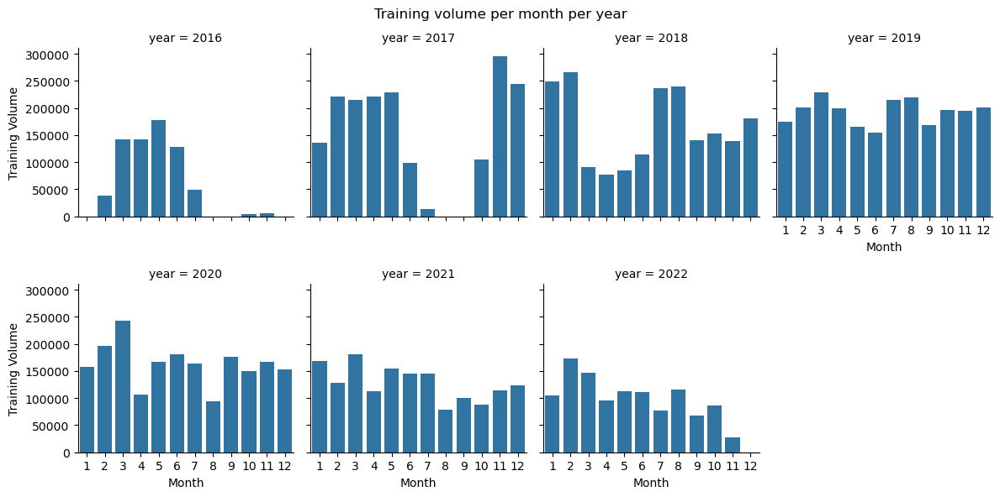
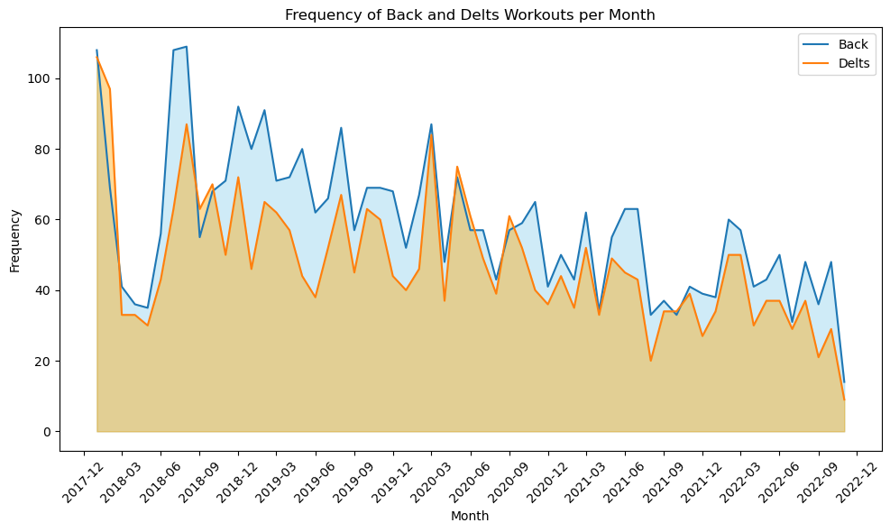
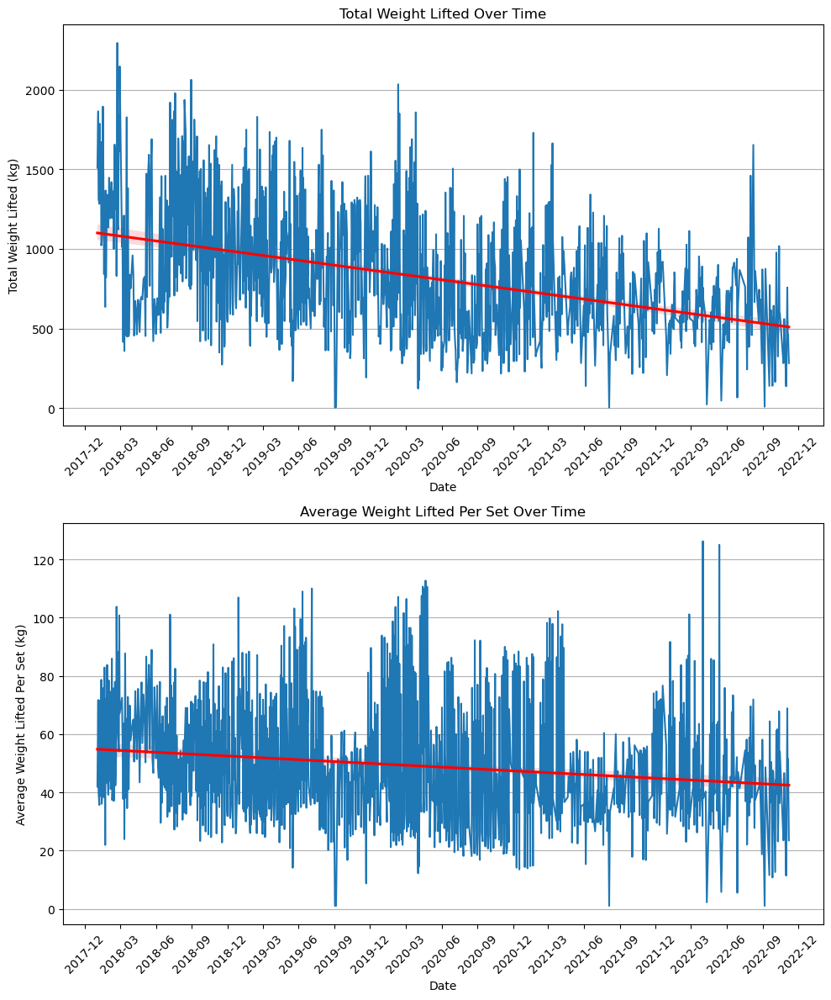
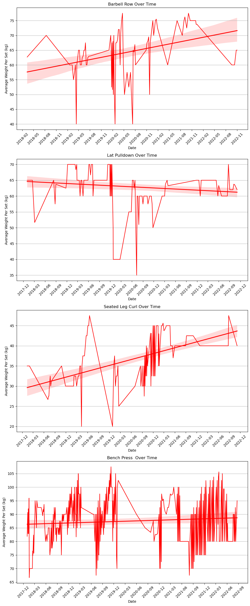
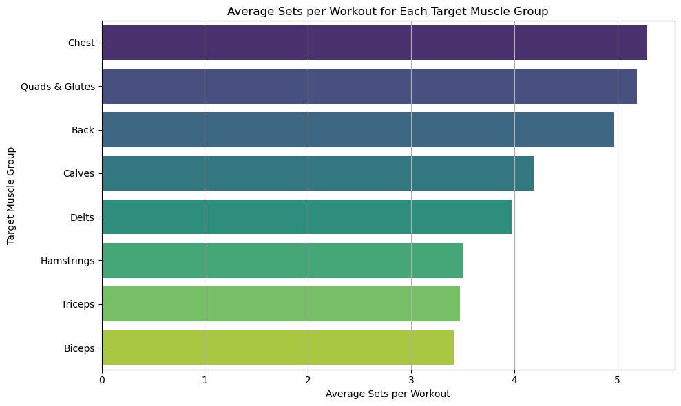

# 1. Introduction
This is an analysis of my personal workout data that I've tracked through a phone application called RepCount, since 2016. Using the RepCount app since 2016, I've amassed a dataset with 26,622 rows and 12 features. The goal here is twofold: sharpen my data analysis skills and uncover some actionable insights about my workout habits. I'm focusing on four main questions:

1. Which months am I most active in the gym?
2. What muscle groups do I focus on the most?
3. Is there an upward trend in the weights I'm lifting?
4. Are there muscle groups that I'm neglecting?

Let's dive in and see where the data leads us.

# 2. Inspecting the Data

We start by importing the libraries that will be used throughout the analysis, and then reading in the dataset.


```python
import numpy as np
import pandas as pd
import seaborn as sns
import matplotlib.pyplot as plt
import matplotlib.dates as mdates
import matplotlib.ticker as ticker
```


```python
"""
Reads the csv file into a dataframe.
After inspecting the datafile in a spreadsheet, the column "Anteckningar" has some values containing ',' which
messes with the CSV format. Therefore we set error_bad_lines to False.
"""
training_data = pd.read_csv('./my_training.csv', on_bad_lines='skip', sep=";")
```

Next, we'll inspect the dataset's content and structure.


```python
training_data.shape
```


    (26622, 12)


```python
training_data.info()
```

    <class 'pandas.core.frame.DataFrame'>
    RangeIndex: 26622 entries, 0 to 26621
    Data columns (total 12 columns):
     #   Column        Non-Null Count  Dtype  
    ---  ------        --------------  -----  
     0   Starttid      26622 non-null  object 
     1   Sluttid       14526 non-null  object 
     2   Övning        26621 non-null  object 
     3   Vikt          26403 non-null  float64
     4   Reps          26441 non-null  float64
     5   Anteckningar  7411 non-null   object 
     6   Kcal          5045 non-null   float64
     7   Distans       5047 non-null   float64
     8   Tid           5081 non-null   float64
     9   Kategori      26622 non-null  object 
     10  Namn          26622 non-null  object 
     11  Kroppsvikt    18742 non-null  float64
    dtypes: float64(6), object(6)
    memory usage: 2.4+ MB


```python
training_data.describe()
```


<div>
<style scoped>
    .dataframe tbody tr th:only-of-type {
        vertical-align: middle;
    }

    .dataframe tbody tr th {
        vertical-align: top;
    }

    .dataframe thead th {
        text-align: right;
    }
</style>
<table border="1" class="dataframe">
  <thead>
    <tr style="text-align: right;">
      <th></th>
      <th>Vikt</th>
      <th>Reps</th>
      <th>Kcal</th>
      <th>Distans</th>
      <th>Tid</th>
      <th>Kroppsvikt</th>
    </tr>
  </thead>
  <tbody>
    <tr>
      <th>count</th>
      <td>26403.000000</td>
      <td>26441.000000</td>
      <td>5045.000000</td>
      <td>5047.000000</td>
      <td>5081.000000</td>
      <td>18742.000000</td>
    </tr>
    <tr>
      <th>mean</th>
      <td>45.130578</td>
      <td>11.113309</td>
      <td>1.715758</td>
      <td>0.044181</td>
      <td>31.467034</td>
      <td>79.549701</td>
    </tr>
    <tr>
      <th>std</th>
      <td>36.330284</td>
      <td>4.204963</td>
      <td>20.258208</td>
      <td>0.500380</td>
      <td>289.684051</td>
      <td>4.432039</td>
    </tr>
    <tr>
      <th>min</th>
      <td>0.000000</td>
      <td>0.000000</td>
      <td>0.000000</td>
      <td>0.000000</td>
      <td>0.000000</td>
      <td>8.000000</td>
    </tr>
    <tr>
      <th>25%</th>
      <td>15.000000</td>
      <td>8.000000</td>
      <td>0.000000</td>
      <td>0.000000</td>
      <td>0.000000</td>
      <td>76.800000</td>
    </tr>
    <tr>
      <th>50%</th>
      <td>32.500000</td>
      <td>11.000000</td>
      <td>0.000000</td>
      <td>0.000000</td>
      <td>0.000000</td>
      <td>79.700000</td>
    </tr>
    <tr>
      <th>75%</th>
      <td>70.000000</td>
      <td>14.000000</td>
      <td>0.000000</td>
      <td>0.000000</td>
      <td>0.000000</td>
      <td>82.200000</td>
    </tr>
    <tr>
      <th>max</th>
      <td>185.000000</td>
      <td>60.000000</td>
      <td>403.000000</td>
      <td>12.650000</td>
      <td>4555.000000</td>
      <td>88.450000</td>
    </tr>
  </tbody>
</table>
</div>


```python
training_data.head(10)
```


<div>
<style scoped>
    .dataframe tbody tr th:only-of-type {
        vertical-align: middle;
    }

    .dataframe tbody tr th {
        vertical-align: top;
    }

    .dataframe thead th {
        text-align: right;
    }
</style>
<table border="1" class="dataframe">
  <thead>
    <tr style="text-align: right;">
      <th></th>
      <th>Starttid</th>
      <th>Sluttid</th>
      <th>Övning</th>
      <th>Vikt</th>
      <th>Reps</th>
      <th>Anteckningar</th>
      <th>Kcal</th>
      <th>Distans</th>
      <th>Tid</th>
      <th>Kategori</th>
      <th>Namn</th>
      <th>Kroppsvikt</th>
    </tr>
  </thead>
  <tbody>
    <tr>
      <th>0</th>
      <td>2022-11-07 11:47</td>
      <td>2022-11-07 12:29</td>
      <td>Incline Bench Press 30’</td>
      <td>65.0</td>
      <td>9.0</td>
      <td>Blev typ 3rir igen, glömde öka till 2rir/+1 (f...</td>
      <td>NaN</td>
      <td>NaN</td>
      <td>NaN</td>
      <td>Chest</td>
      <td>Lunch 1</td>
      <td>82.85</td>
    </tr>
    <tr>
      <th>1</th>
      <td>2022-11-07 11:47</td>
      <td>2022-11-07 12:29</td>
      <td>Incline Bench Press 30’</td>
      <td>65.0</td>
      <td>8.0</td>
      <td>Över steg 8</td>
      <td>NaN</td>
      <td>NaN</td>
      <td>NaN</td>
      <td>Chest</td>
      <td>Lunch 1</td>
      <td>82.85</td>
    </tr>
    <tr>
      <th>2</th>
      <td>2022-11-07 11:47</td>
      <td>2022-11-07 12:29</td>
      <td>Incline Bench Press 30’</td>
      <td>65.0</td>
      <td>7.0</td>
      <td>NaN</td>
      <td>NaN</td>
      <td>NaN</td>
      <td>NaN</td>
      <td>Chest</td>
      <td>Lunch 1</td>
      <td>82.85</td>
    </tr>
    <tr>
      <th>3</th>
      <td>2022-11-07 11:47</td>
      <td>2022-11-07 12:29</td>
      <td>Pull Up</td>
      <td>0.0</td>
      <td>12.0</td>
      <td>+1</td>
      <td>NaN</td>
      <td>NaN</td>
      <td>NaN</td>
      <td>Back</td>
      <td>Lunch 1</td>
      <td>82.85</td>
    </tr>
    <tr>
      <th>4</th>
      <td>2022-11-07 11:47</td>
      <td>2022-11-07 12:29</td>
      <td>Pull Up</td>
      <td>0.0</td>
      <td>9.0</td>
      <td>NaN</td>
      <td>NaN</td>
      <td>NaN</td>
      <td>NaN</td>
      <td>Back</td>
      <td>Lunch 1</td>
      <td>82.85</td>
    </tr>
    <tr>
      <th>5</th>
      <td>2022-11-07 11:47</td>
      <td>2022-11-07 12:29</td>
      <td>Pull Up</td>
      <td>0.0</td>
      <td>7.0</td>
      <td>NaN</td>
      <td>NaN</td>
      <td>NaN</td>
      <td>NaN</td>
      <td>Back</td>
      <td>Lunch 1</td>
      <td>82.85</td>
    </tr>
    <tr>
      <th>6</th>
      <td>2022-11-07 11:47</td>
      <td>2022-11-07 12:29</td>
      <td>Dips</td>
      <td>0.0</td>
      <td>15.0</td>
      <td>2rir</td>
      <td>NaN</td>
      <td>NaN</td>
      <td>NaN</td>
      <td>Triceps</td>
      <td>Lunch 1</td>
      <td>82.85</td>
    </tr>
    <tr>
      <th>7</th>
      <td>2022-11-07 11:47</td>
      <td>2022-11-07 12:29</td>
      <td>Dips</td>
      <td>0.0</td>
      <td>10.0</td>
      <td>NaN</td>
      <td>NaN</td>
      <td>NaN</td>
      <td>NaN</td>
      <td>Triceps</td>
      <td>Lunch 1</td>
      <td>82.85</td>
    </tr>
    <tr>
      <th>8</th>
      <td>2022-11-07 11:47</td>
      <td>2022-11-07 12:29</td>
      <td>Dips</td>
      <td>0.0</td>
      <td>8.0</td>
      <td>NaN</td>
      <td>NaN</td>
      <td>NaN</td>
      <td>NaN</td>
      <td>Triceps</td>
      <td>Lunch 1</td>
      <td>82.85</td>
    </tr>
    <tr>
      <th>9</th>
      <td>2022-11-07 11:47</td>
      <td>2022-11-07 12:29</td>
      <td>Startrac Biceps Curl</td>
      <td>27.0</td>
      <td>13.0</td>
      <td>NaN</td>
      <td>NaN</td>
      <td>NaN</td>
      <td>NaN</td>
      <td>Biceps</td>
      <td>Lunch 1</td>
      <td>82.85</td>
    </tr>
  </tbody>
</table>
</div>


We have 12 different columns with varying levels of missing data, and 26622 rows. Each row represents a single set (a group of consecutive repetitions of an excercise performed without resting), containing metrics such as excercise type, weight, number of reps (repetitions), etc. 

Let's examine the missing data further.

### Missing Data


```python
# Number of missing data per feature
training_data.isnull().sum()
```


    Starttid            0
    Sluttid         12096
    Övning              1
    Vikt              219
    Reps              181
    Anteckningar    19211
    Kcal            21577
    Distans         21575
    Tid             21541
    Kategori            0
    Namn                0
    Kroppsvikt       7880
    dtype: int64


```python
# Calculate the % of missing data per feature
total = training_data.isnull().sum().sort_values(ascending=False)  

percent_1 = training_data.isnull().sum()/training_data.isnull().count()*100  
percent_2 = (round(percent_1, 1)).sort_values(ascending=False)  

missing_data = pd.concat([total, percent_2], axis=1, keys=['Total', '%'])  

missing_data.loc[total > 0]
```


<div>
<style scoped>
    .dataframe tbody tr th:only-of-type {
        vertical-align: middle;
    }

    .dataframe tbody tr th {
        vertical-align: top;
    }

    .dataframe thead th {
        text-align: right;
    }
</style>
<table border="1" class="dataframe">
  <thead>
    <tr style="text-align: right;">
      <th></th>
      <th>Total</th>
      <th>%</th>
    </tr>
  </thead>
  <tbody>
    <tr>
      <th>Kcal</th>
      <td>21577</td>
      <td>81.0</td>
    </tr>
    <tr>
      <th>Distans</th>
      <td>21575</td>
      <td>81.0</td>
    </tr>
    <tr>
      <th>Tid</th>
      <td>21541</td>
      <td>80.9</td>
    </tr>
    <tr>
      <th>Anteckningar</th>
      <td>19211</td>
      <td>72.2</td>
    </tr>
    <tr>
      <th>Sluttid</th>
      <td>12096</td>
      <td>45.4</td>
    </tr>
    <tr>
      <th>Kroppsvikt</th>
      <td>7880</td>
      <td>29.6</td>
    </tr>
    <tr>
      <th>Vikt</th>
      <td>219</td>
      <td>0.8</td>
    </tr>
    <tr>
      <th>Reps</th>
      <td>181</td>
      <td>0.7</td>
    </tr>
    <tr>
      <th>Övning</th>
      <td>1</td>
      <td>0.0</td>
    </tr>
  </tbody>
</table>
</div>


Several of these features contain too much missing data to be useful. The best option is to just drop these columns before the analysis (kcal, distans, tid, anteckningar, sluttid, and maybe kroppsvikt). 

I'd also like to see whether there are any periods throughout these years where I haven't been tracking my workouts consistently. I know I've been working out regularly, so let's check out my frequency of workouts on a monthly basis and if it has any dips. 


```python
# Start by creating a new df as a copy of the original data, now that we're going to make edits
df = training_data.copy()
```


```python
df.head()
```


<div>
<style scoped>
    .dataframe tbody tr th:only-of-type {
        vertical-align: middle;
    }

    .dataframe tbody tr th {
        vertical-align: top;
    }

    .dataframe thead th {
        text-align: right;
    }
</style>
<table border="1" class="dataframe">
  <thead>
    <tr style="text-align: right;">
      <th></th>
      <th>Starttid</th>
      <th>Sluttid</th>
      <th>Övning</th>
      <th>Vikt</th>
      <th>Reps</th>
      <th>Anteckningar</th>
      <th>Kcal</th>
      <th>Distans</th>
      <th>Tid</th>
      <th>Kategori</th>
      <th>Namn</th>
      <th>Kroppsvikt</th>
    </tr>
  </thead>
  <tbody>
    <tr>
      <th>0</th>
      <td>2022-11-07 11:47</td>
      <td>2022-11-07 12:29</td>
      <td>Incline Bench Press 30’</td>
      <td>65.0</td>
      <td>9.0</td>
      <td>Blev typ 3rir igen, glömde öka till 2rir/+1 (f...</td>
      <td>NaN</td>
      <td>NaN</td>
      <td>NaN</td>
      <td>Chest</td>
      <td>Lunch 1</td>
      <td>82.85</td>
    </tr>
    <tr>
      <th>1</th>
      <td>2022-11-07 11:47</td>
      <td>2022-11-07 12:29</td>
      <td>Incline Bench Press 30’</td>
      <td>65.0</td>
      <td>8.0</td>
      <td>Över steg 8</td>
      <td>NaN</td>
      <td>NaN</td>
      <td>NaN</td>
      <td>Chest</td>
      <td>Lunch 1</td>
      <td>82.85</td>
    </tr>
    <tr>
      <th>2</th>
      <td>2022-11-07 11:47</td>
      <td>2022-11-07 12:29</td>
      <td>Incline Bench Press 30’</td>
      <td>65.0</td>
      <td>7.0</td>
      <td>NaN</td>
      <td>NaN</td>
      <td>NaN</td>
      <td>NaN</td>
      <td>Chest</td>
      <td>Lunch 1</td>
      <td>82.85</td>
    </tr>
    <tr>
      <th>3</th>
      <td>2022-11-07 11:47</td>
      <td>2022-11-07 12:29</td>
      <td>Pull Up</td>
      <td>0.0</td>
      <td>12.0</td>
      <td>+1</td>
      <td>NaN</td>
      <td>NaN</td>
      <td>NaN</td>
      <td>Back</td>
      <td>Lunch 1</td>
      <td>82.85</td>
    </tr>
    <tr>
      <th>4</th>
      <td>2022-11-07 11:47</td>
      <td>2022-11-07 12:29</td>
      <td>Pull Up</td>
      <td>0.0</td>
      <td>9.0</td>
      <td>NaN</td>
      <td>NaN</td>
      <td>NaN</td>
      <td>NaN</td>
      <td>Back</td>
      <td>Lunch 1</td>
      <td>82.85</td>
    </tr>
  </tbody>
</table>
</div>


```python
# Parse 'Starttid' column as a datetime object
df['parsed_date'] = pd.to_datetime(df['Starttid'], format="%Y-%m-%d %H:%M")
```


```python
# Create a year-month column
df['year-month'] = df['parsed_date'].dt.strftime('%Y-%m')
```


```python
# Validate the new columns
df[['parsed_date', 'year-month']].head()
```


<div>
<style scoped>
    .dataframe tbody tr th:only-of-type {
        vertical-align: middle;
    }

    .dataframe tbody tr th {
        vertical-align: top;
    }

    .dataframe thead th {
        text-align: right;
    }
</style>
<table border="1" class="dataframe">
  <thead>
    <tr style="text-align: right;">
      <th></th>
      <th>parsed_date</th>
      <th>year-month</th>
    </tr>
  </thead>
  <tbody>
    <tr>
      <th>0</th>
      <td>2022-11-07 11:47:00</td>
      <td>2022-11</td>
    </tr>
    <tr>
      <th>1</th>
      <td>2022-11-07 11:47:00</td>
      <td>2022-11</td>
    </tr>
    <tr>
      <th>2</th>
      <td>2022-11-07 11:47:00</td>
      <td>2022-11</td>
    </tr>
    <tr>
      <th>3</th>
      <td>2022-11-07 11:47:00</td>
      <td>2022-11</td>
    </tr>
    <tr>
      <th>4</th>
      <td>2022-11-07 11:47:00</td>
      <td>2022-11</td>
    </tr>
  </tbody>
</table>
</div>


```python
# Get the number of unique dates (workouts) per year-month
frequency_by_year_month = df.groupby('year-month')['parsed_date'].nunique()
frequency_by_year_month = frequency_by_year_month.reset_index()
```


```python
frequency_by_year_month
```


<div>
<style scoped>
    .dataframe tbody tr th:only-of-type {
        vertical-align: middle;
    }

    .dataframe tbody tr th {
        vertical-align: top;
    }

    .dataframe thead th {
        text-align: right;
    }
</style>
<table border="1" class="dataframe">
  <thead>
    <tr style="text-align: right;">
      <th></th>
      <th>year-month</th>
      <th>parsed_date</th>
    </tr>
  </thead>
  <tbody>
    <tr>
      <th>0</th>
      <td>2016-02</td>
      <td>8</td>
    </tr>
    <tr>
      <th>1</th>
      <td>2016-03</td>
      <td>20</td>
    </tr>
    <tr>
      <th>2</th>
      <td>2016-04</td>
      <td>18</td>
    </tr>
    <tr>
      <th>3</th>
      <td>2016-05</td>
      <td>23</td>
    </tr>
    <tr>
      <th>4</th>
      <td>2016-06</td>
      <td>20</td>
    </tr>
    <tr>
      <th>...</th>
      <td>...</td>
      <td>...</td>
    </tr>
    <tr>
      <th>72</th>
      <td>2022-07</td>
      <td>11</td>
    </tr>
    <tr>
      <th>73</th>
      <td>2022-08</td>
      <td>14</td>
    </tr>
    <tr>
      <th>74</th>
      <td>2022-09</td>
      <td>13</td>
    </tr>
    <tr>
      <th>75</th>
      <td>2022-10</td>
      <td>16</td>
    </tr>
    <tr>
      <th>76</th>
      <td>2022-11</td>
      <td>6</td>
    </tr>
  </tbody>
</table>
<p>77 rows × 2 columns</p>
</div>


```python
plt.figure(figsize=(20, 6))

sns.lineplot(x=frequency_by_year_month['year-month'], y=frequency_by_year_month['parsed_date'])
plt.xlabel('Month')
plt.ylabel('Frequency')
plt.title('Frequency of Overall Workouts per Month')
plt.xticks(rotation=45) # Rotate x-axis labels for better readability
plt.grid(True) # Add a grid

plt.show()
```


    

    


Observing the plot, we see that there are some periods around July 2016 and June 2017 where I've barely recorded any workouts. We have complete data between 2018 and September 2022. 

I also notice that I've recorded >30 workouts in April and June of 2020. During that time period, I experimented with training twice a day some days. I did not workout everyday.

### Summary 
- Data ranges from February 2016 until November 2022
- There are a about three months in total spread out over 2016/2017 where I most likely worked out without tracking it
- Dataset contains 26622 rows and 12 features
- There's currently 1 row per set per excercise per day
- Some features have too much missing data to be useful and some features aren't useful in answering our questions
- We'll have to do some feature engineering to create some new variables in order to answer our research questions

# 3. Data Cleaning 

It's time to clean this data so it can be properly analyzed later.

### Drop features

We'll start by dropping features we won't need due to large amounts of missing data rendering them pretty much useless.


```python
df.columns
```


    Index(['Starttid', 'Sluttid', 'Övning', 'Vikt', 'Reps', 'Anteckningar', 'Kcal',
           'Distans', 'Tid', 'Kategori', 'Namn', 'Kroppsvikt', 'parsed_date',
           'year-month'],
          dtype='object')


```python
# Dropping columns not needed for the analysis
df = df.drop(['Anteckningar', 'Namn', 'Sluttid', 'Kcal', 'Distans', 'Tid'], axis=1)
```

### Renaming 

Let's rename our columns to english language.


```python
df.rename(columns={'Starttid': 'date', 
                   'Kategori': 'target_muscle',
                   'Övning': 'excercise_type',
                   'Vikt': 'weight',
                   'Reps': 'reps',
                   'Kroppsvikt': 'bodyweight',
                  }, inplace=True)
```


```python
df.head(5)
```


<div>
<style scoped>
    .dataframe tbody tr th:only-of-type {
        vertical-align: middle;
    }

    .dataframe tbody tr th {
        vertical-align: top;
    }

    .dataframe thead th {
        text-align: right;
    }
</style>
<table border="1" class="dataframe">
  <thead>
    <tr style="text-align: right;">
      <th></th>
      <th>date</th>
      <th>excercise_type</th>
      <th>weight</th>
      <th>reps</th>
      <th>target_muscle</th>
      <th>bodyweight</th>
      <th>parsed_date</th>
      <th>year-month</th>
    </tr>
  </thead>
  <tbody>
    <tr>
      <th>0</th>
      <td>2022-11-07 11:47</td>
      <td>Incline Bench Press 30’</td>
      <td>65.0</td>
      <td>9.0</td>
      <td>Chest</td>
      <td>82.85</td>
      <td>2022-11-07 11:47:00</td>
      <td>2022-11</td>
    </tr>
    <tr>
      <th>1</th>
      <td>2022-11-07 11:47</td>
      <td>Incline Bench Press 30’</td>
      <td>65.0</td>
      <td>8.0</td>
      <td>Chest</td>
      <td>82.85</td>
      <td>2022-11-07 11:47:00</td>
      <td>2022-11</td>
    </tr>
    <tr>
      <th>2</th>
      <td>2022-11-07 11:47</td>
      <td>Incline Bench Press 30’</td>
      <td>65.0</td>
      <td>7.0</td>
      <td>Chest</td>
      <td>82.85</td>
      <td>2022-11-07 11:47:00</td>
      <td>2022-11</td>
    </tr>
    <tr>
      <th>3</th>
      <td>2022-11-07 11:47</td>
      <td>Pull Up</td>
      <td>0.0</td>
      <td>12.0</td>
      <td>Back</td>
      <td>82.85</td>
      <td>2022-11-07 11:47:00</td>
      <td>2022-11</td>
    </tr>
    <tr>
      <th>4</th>
      <td>2022-11-07 11:47</td>
      <td>Pull Up</td>
      <td>0.0</td>
      <td>9.0</td>
      <td>Back</td>
      <td>82.85</td>
      <td>2022-11-07 11:47:00</td>
      <td>2022-11</td>
    </tr>
  </tbody>
</table>
</div>


```python
df.count()
```


    date              26622
    excercise_type    26621
    weight            26403
    reps              26441
    target_muscle     26622
    bodyweight        18742
    parsed_date       26622
    year-month        26622
    dtype: int64


Now we have approximately the same number of entries in our features except for bodyweight. Since this analysis will be purely exploratory, we don't have to "deal" with missing data in the same way we would have if we were creating a model or statistical inference. Same goes for outliers. 


Let's check if bodyweight is randomly missing throughout the dataset or if it's mainly missing during a specific time period.


```python
# Group by 'year-month' and count the unique dates with 'bodyweight' entries for each month
unique_bodyweight_days = df.groupby('year-month')['parsed_date'].nunique()

plt.figure(figsize=(20, 6))

sns.lineplot(x=unique_bodyweight_days.index, y=unique_bodyweight_days.values)
plt.xlabel('Month')
plt.ylabel('Frequency')
plt.title('Number of days with bodyweight entries')
plt.xticks(rotation=45)  # Rotate x-axis labels for better readability
plt.grid(True)  # Add a grid

plt.show()

```


    

    


The "missing" bodyweight entries seem to primarily correspond to the time periods when I didn't track my workouts using this application.

I also noticed that bodyweight excercises like pullups, have 0 as weight since it's performed using the bodyweight only.
I've performed a few bodyweight excercises with some regularity: pullups, chinups, dips, pushups. Let's replace any 0's 
in those excercies with a 1, so it doesn't get multiplied by 0 if we're doing any calculations using weight. 


```python
bw_excercises_mask = df['weight'] == 0
```


```python
# Double what excercise types have a weight of 0
df[bw_excercises_mask]['excercise_type'].unique()
```


    array(['Pull Up', 'Dips', 'Back Extension', 'Chin Up', 'Push Ups',
           'DB Lunges', 'Close Grip Pushups', 'Decline Pushup',
           'Deficit Pushups', 'Sit ups', 'Clavicle Pullups',
           'Single Leg Calf Raise', 'Bent DB Upright Row', 'BW Squats',
           'Hanging Leg Raise', 'CG Chin-Up', 'BW Elevated Heel Squat',
           'Hängande benlyft', 'Crunches', 'Crunch', 'BB Lunges',
           'High Bar Squat', 'Hanging Knee Raises', 'Brutalbänk',
           'Reaching Sit-ups', 'Crunch on Bosuball', 'Incline Pushup',
           'Pistol Box Squats ', 'Reverse Crunch', 'Decline Reverse Crunch ',
           'Hanging Reverse Crunch', 'TRX knee-pulls', 'Crunches on a Ball',
           'Tricep Dips', 'Wide Push Ups', 'Stående vadpress på ett ben',
           'Standing Calf Press', 'Benlyft på armbågarna',
           'Knee raises on parallel bars', 'Bulgarian DB Split Squat',
           'Crunches on Back Extension', 'Negative Single Leg Dragon Flag',
           'Negative Dragon Flag', 'Barbell Curl', 'Hammer Strength Crunch',
           'Wrist-pushups on knees', 'Leg Raises', 'Ab-chair',
           'Ab-Wheel rollouts on knees', 'Planka 1 rep = 1 sekund',
           'Side to side Push Up', 'Ring Pullup'], dtype=object)


```python
# Replace 0s with 1s for bodyweight excercises
df.loc[bw_excercises_mask, 'weight'] = 1
```


```python
# Validate
df[bw_excercises_mask].head()
```


<div>
<style scoped>
    .dataframe tbody tr th:only-of-type {
        vertical-align: middle;
    }

    .dataframe tbody tr th {
        vertical-align: top;
    }

    .dataframe thead th {
        text-align: right;
    }
</style>
<table border="1" class="dataframe">
  <thead>
    <tr style="text-align: right;">
      <th></th>
      <th>date</th>
      <th>excercise_type</th>
      <th>weight</th>
      <th>reps</th>
      <th>target_muscle</th>
      <th>bodyweight</th>
      <th>parsed_date</th>
      <th>year-month</th>
    </tr>
  </thead>
  <tbody>
    <tr>
      <th>3</th>
      <td>2022-11-07 11:47</td>
      <td>Pull Up</td>
      <td>1.0</td>
      <td>12.0</td>
      <td>Back</td>
      <td>82.85</td>
      <td>2022-11-07 11:47:00</td>
      <td>2022-11</td>
    </tr>
    <tr>
      <th>4</th>
      <td>2022-11-07 11:47</td>
      <td>Pull Up</td>
      <td>1.0</td>
      <td>9.0</td>
      <td>Back</td>
      <td>82.85</td>
      <td>2022-11-07 11:47:00</td>
      <td>2022-11</td>
    </tr>
    <tr>
      <th>5</th>
      <td>2022-11-07 11:47</td>
      <td>Pull Up</td>
      <td>1.0</td>
      <td>7.0</td>
      <td>Back</td>
      <td>82.85</td>
      <td>2022-11-07 11:47:00</td>
      <td>2022-11</td>
    </tr>
    <tr>
      <th>6</th>
      <td>2022-11-07 11:47</td>
      <td>Dips</td>
      <td>1.0</td>
      <td>15.0</td>
      <td>Triceps</td>
      <td>82.85</td>
      <td>2022-11-07 11:47:00</td>
      <td>2022-11</td>
    </tr>
    <tr>
      <th>7</th>
      <td>2022-11-07 11:47</td>
      <td>Dips</td>
      <td>1.0</td>
      <td>10.0</td>
      <td>Triceps</td>
      <td>82.85</td>
      <td>2022-11-07 11:47:00</td>
      <td>2022-11</td>
    </tr>
  </tbody>
</table>
</div>


### Summary 
- Dropped features with significant missing data to streamline the analysis.
- Columns renamed to English for better readability and understanding.
- No major concern over missing 'bodyweight' data, as it's mostly from periods when workouts weren't tracked.
- Exercises using bodyweight (e.g., pullups) initially had a weight value of 0; these were replaced with 1 to avoid computational issues in weight-based calculations.

# 3. Organising Data

At this stage, we've removed uneccesary columns, renamed the remaining, examined mising data, and changed the weight for bodyweight exercises from 0 to 1 in order to not have any potential multiplcations of 0. 

Now, we're going to engineer some new features based on the existing features to make the dataset more useful and easier to analyze. 

### Date Features

First, we'll edit the `parsed_date` column so it just keeps the date, not the time-part of it.


```python
# str[:10] to grab the dates without the hours:minutes
df['parsed_date'] = pd.to_datetime(df['date'].str[:10], format="%Y-%m-%d")

df['parsed_date'].head(3)
```


    0   2022-11-07
    1   2022-11-07
    2   2022-11-07
    Name: parsed_date, dtype: datetime64[ns]


We already have year-month columns, but I'll also want columns months independent of the year, the year itself, and weeks.


```python
# Adding year and month to each row
df['year'] = df['parsed_date'].dt.year
df['month'] = df['parsed_date'].dt.month
df['week'] = df['parsed_date'].dt.isocalendar().week

df[['year', 'year-month', 'month', 'week']]
```


<div>
<style scoped>
    .dataframe tbody tr th:only-of-type {
        vertical-align: middle;
    }

    .dataframe tbody tr th {
        vertical-align: top;
    }

    .dataframe thead th {
        text-align: right;
    }
</style>
<table border="1" class="dataframe">
  <thead>
    <tr style="text-align: right;">
      <th></th>
      <th>year</th>
      <th>year-month</th>
      <th>month</th>
      <th>week</th>
    </tr>
  </thead>
  <tbody>
    <tr>
      <th>0</th>
      <td>2022</td>
      <td>2022-11</td>
      <td>11</td>
      <td>45</td>
    </tr>
    <tr>
      <th>1</th>
      <td>2022</td>
      <td>2022-11</td>
      <td>11</td>
      <td>45</td>
    </tr>
    <tr>
      <th>2</th>
      <td>2022</td>
      <td>2022-11</td>
      <td>11</td>
      <td>45</td>
    </tr>
    <tr>
      <th>3</th>
      <td>2022</td>
      <td>2022-11</td>
      <td>11</td>
      <td>45</td>
    </tr>
    <tr>
      <th>4</th>
      <td>2022</td>
      <td>2022-11</td>
      <td>11</td>
      <td>45</td>
    </tr>
    <tr>
      <th>...</th>
      <td>...</td>
      <td>...</td>
      <td>...</td>
      <td>...</td>
    </tr>
    <tr>
      <th>26617</th>
      <td>2016</td>
      <td>2016-02</td>
      <td>2</td>
      <td>7</td>
    </tr>
    <tr>
      <th>26618</th>
      <td>2016</td>
      <td>2016-02</td>
      <td>2</td>
      <td>7</td>
    </tr>
    <tr>
      <th>26619</th>
      <td>2016</td>
      <td>2016-02</td>
      <td>2</td>
      <td>7</td>
    </tr>
    <tr>
      <th>26620</th>
      <td>2016</td>
      <td>2016-02</td>
      <td>2</td>
      <td>7</td>
    </tr>
    <tr>
      <th>26621</th>
      <td>2016</td>
      <td>2016-02</td>
      <td>2</td>
      <td>7</td>
    </tr>
  </tbody>
</table>
<p>26622 rows × 4 columns</p>
</div>


### Calculate training volume

How much (not how frequently) someone trains can be summarized as training volume.  
Training volume can be measured as number of "tough" sets OR as weight x reps. 

Since each row is one set, we'll just add a column "sets" and set it to 1 for each row so it will be super easy to see 
the number of sets when aggregating the data.

We'll also create a column "training_volume" that's lifted weight multiplied by reps (the number of times the weight was lifted).


```python
# Create a new column for training volume based on number of sets (used in aggregations)
df['sets'] = 1
df['training_volume'] = df['weight'] * df['reps']
```


```python
# Validate
df.head()
```


<div>
<style scoped>
    .dataframe tbody tr th:only-of-type {
        vertical-align: middle;
    }

    .dataframe tbody tr th {
        vertical-align: top;
    }

    .dataframe thead th {
        text-align: right;
    }
</style>
<table border="1" class="dataframe">
  <thead>
    <tr style="text-align: right;">
      <th></th>
      <th>date</th>
      <th>excercise_type</th>
      <th>weight</th>
      <th>reps</th>
      <th>target_muscle</th>
      <th>bodyweight</th>
      <th>parsed_date</th>
      <th>year-month</th>
      <th>year</th>
      <th>month</th>
      <th>week</th>
      <th>sets</th>
      <th>training_volume</th>
    </tr>
  </thead>
  <tbody>
    <tr>
      <th>0</th>
      <td>2022-11-07 11:47</td>
      <td>Incline Bench Press 30’</td>
      <td>65.0</td>
      <td>9.0</td>
      <td>Chest</td>
      <td>82.85</td>
      <td>2022-11-07</td>
      <td>2022-11</td>
      <td>2022</td>
      <td>11</td>
      <td>45</td>
      <td>1</td>
      <td>585.0</td>
    </tr>
    <tr>
      <th>1</th>
      <td>2022-11-07 11:47</td>
      <td>Incline Bench Press 30’</td>
      <td>65.0</td>
      <td>8.0</td>
      <td>Chest</td>
      <td>82.85</td>
      <td>2022-11-07</td>
      <td>2022-11</td>
      <td>2022</td>
      <td>11</td>
      <td>45</td>
      <td>1</td>
      <td>520.0</td>
    </tr>
    <tr>
      <th>2</th>
      <td>2022-11-07 11:47</td>
      <td>Incline Bench Press 30’</td>
      <td>65.0</td>
      <td>7.0</td>
      <td>Chest</td>
      <td>82.85</td>
      <td>2022-11-07</td>
      <td>2022-11</td>
      <td>2022</td>
      <td>11</td>
      <td>45</td>
      <td>1</td>
      <td>455.0</td>
    </tr>
    <tr>
      <th>3</th>
      <td>2022-11-07 11:47</td>
      <td>Pull Up</td>
      <td>1.0</td>
      <td>12.0</td>
      <td>Back</td>
      <td>82.85</td>
      <td>2022-11-07</td>
      <td>2022-11</td>
      <td>2022</td>
      <td>11</td>
      <td>45</td>
      <td>1</td>
      <td>12.0</td>
    </tr>
    <tr>
      <th>4</th>
      <td>2022-11-07 11:47</td>
      <td>Pull Up</td>
      <td>1.0</td>
      <td>9.0</td>
      <td>Back</td>
      <td>82.85</td>
      <td>2022-11-07</td>
      <td>2022-11</td>
      <td>2022</td>
      <td>11</td>
      <td>45</td>
      <td>1</td>
      <td>9.0</td>
    </tr>
  </tbody>
</table>
</div>


### Create dummy columns per target muscle

It would be nice to have a way of measuring volume per bodypart (`target_muscle`) in upcoming aggregations. Let's create dummy variables for the categories of `target_muscle`.


```python
# Check what muscle groups we have
df['target_muscle'].unique()
```


    array(['Chest', 'Back', 'Triceps', 'Biceps', 'Hamstrings',
           'Quads & Glutes', 'Delts', 'Abs', 'Calves', 'Traps', 'Forearms',
           'Cardio', 'Övriga', 'Calisthenics'], dtype=object)


I notice some muscle groups that are not of interest or that I know I've trained super unregularly so they won't have much data.


```python
muscles_to_drop = ['Abs', 'Traps', 'Forearms', 'Cardio', 'Övriga', 'Calisthenics']

# Drop unwanted muscle groups
for muscle in muscles_to_drop:
    if muscle in df['target_muscle'].unique():
        df = df[df['target_muscle'] != muscle]

# Check muscle groups again
df['target_muscle'].unique()
```


    array(['Chest', 'Back', 'Triceps', 'Biceps', 'Hamstrings',
           'Quads & Glutes', 'Delts', 'Calves'], dtype=object)


```python
# Create dummy variables without dropping 'target_muscle'
dummies = pd.get_dummies(df['target_muscle'], prefix='', prefix_sep='')

# Concatenate the dummy DataFrame with the original DataFrame
df = pd.concat([df, dummies], axis=1)

```


```python
# Make sure dummy variables are correct
df.head()
```


<div>
<style scoped>
    .dataframe tbody tr th:only-of-type {
        vertical-align: middle;
    }

    .dataframe tbody tr th {
        vertical-align: top;
    }

    .dataframe thead th {
        text-align: right;
    }
</style>
<table border="1" class="dataframe">
  <thead>
    <tr style="text-align: right;">
      <th></th>
      <th>date</th>
      <th>excercise_type</th>
      <th>weight</th>
      <th>reps</th>
      <th>target_muscle</th>
      <th>bodyweight</th>
      <th>parsed_date</th>
      <th>year-month</th>
      <th>year</th>
      <th>month</th>
      <th>...</th>
      <th>sets</th>
      <th>training_volume</th>
      <th>Back</th>
      <th>Biceps</th>
      <th>Calves</th>
      <th>Chest</th>
      <th>Delts</th>
      <th>Hamstrings</th>
      <th>Quads &amp; Glutes</th>
      <th>Triceps</th>
    </tr>
  </thead>
  <tbody>
    <tr>
      <th>0</th>
      <td>2022-11-07 11:47</td>
      <td>Incline Bench Press 30’</td>
      <td>65.0</td>
      <td>9.0</td>
      <td>Chest</td>
      <td>82.85</td>
      <td>2022-11-07</td>
      <td>2022-11</td>
      <td>2022</td>
      <td>11</td>
      <td>...</td>
      <td>1</td>
      <td>585.0</td>
      <td>0</td>
      <td>0</td>
      <td>0</td>
      <td>1</td>
      <td>0</td>
      <td>0</td>
      <td>0</td>
      <td>0</td>
    </tr>
    <tr>
      <th>1</th>
      <td>2022-11-07 11:47</td>
      <td>Incline Bench Press 30’</td>
      <td>65.0</td>
      <td>8.0</td>
      <td>Chest</td>
      <td>82.85</td>
      <td>2022-11-07</td>
      <td>2022-11</td>
      <td>2022</td>
      <td>11</td>
      <td>...</td>
      <td>1</td>
      <td>520.0</td>
      <td>0</td>
      <td>0</td>
      <td>0</td>
      <td>1</td>
      <td>0</td>
      <td>0</td>
      <td>0</td>
      <td>0</td>
    </tr>
    <tr>
      <th>2</th>
      <td>2022-11-07 11:47</td>
      <td>Incline Bench Press 30’</td>
      <td>65.0</td>
      <td>7.0</td>
      <td>Chest</td>
      <td>82.85</td>
      <td>2022-11-07</td>
      <td>2022-11</td>
      <td>2022</td>
      <td>11</td>
      <td>...</td>
      <td>1</td>
      <td>455.0</td>
      <td>0</td>
      <td>0</td>
      <td>0</td>
      <td>1</td>
      <td>0</td>
      <td>0</td>
      <td>0</td>
      <td>0</td>
    </tr>
    <tr>
      <th>3</th>
      <td>2022-11-07 11:47</td>
      <td>Pull Up</td>
      <td>1.0</td>
      <td>12.0</td>
      <td>Back</td>
      <td>82.85</td>
      <td>2022-11-07</td>
      <td>2022-11</td>
      <td>2022</td>
      <td>11</td>
      <td>...</td>
      <td>1</td>
      <td>12.0</td>
      <td>1</td>
      <td>0</td>
      <td>0</td>
      <td>0</td>
      <td>0</td>
      <td>0</td>
      <td>0</td>
      <td>0</td>
    </tr>
    <tr>
      <th>4</th>
      <td>2022-11-07 11:47</td>
      <td>Pull Up</td>
      <td>1.0</td>
      <td>9.0</td>
      <td>Back</td>
      <td>82.85</td>
      <td>2022-11-07</td>
      <td>2022-11</td>
      <td>2022</td>
      <td>11</td>
      <td>...</td>
      <td>1</td>
      <td>9.0</td>
      <td>1</td>
      <td>0</td>
      <td>0</td>
      <td>0</td>
      <td>0</td>
      <td>0</td>
      <td>0</td>
      <td>0</td>
    </tr>
  </tbody>
</table>
<p>5 rows × 21 columns</p>
</div>


From the data exploration, we know that we have periods in 2016-2017 during which workouts weren't track at all. Let's create two separate dataframe to go from here, on with the whole dataset, and another from 2018 which only contains "complete" data. 


```python
df_complete = df[df['parsed_date'].dt.year > 2017]
df_all = df.copy()
```


```python
df_all.tail()
```


<div>
<style scoped>
    .dataframe tbody tr th:only-of-type {
        vertical-align: middle;
    }

    .dataframe tbody tr th {
        vertical-align: top;
    }

    .dataframe thead th {
        text-align: right;
    }
</style>
<table border="1" class="dataframe">
  <thead>
    <tr style="text-align: right;">
      <th></th>
      <th>date</th>
      <th>excercise_type</th>
      <th>weight</th>
      <th>reps</th>
      <th>target_muscle</th>
      <th>bodyweight</th>
      <th>parsed_date</th>
      <th>year-month</th>
      <th>year</th>
      <th>month</th>
      <th>...</th>
      <th>sets</th>
      <th>training_volume</th>
      <th>Back</th>
      <th>Biceps</th>
      <th>Calves</th>
      <th>Chest</th>
      <th>Delts</th>
      <th>Hamstrings</th>
      <th>Quads &amp; Glutes</th>
      <th>Triceps</th>
    </tr>
  </thead>
  <tbody>
    <tr>
      <th>26617</th>
      <td>2016-02-18 20:45</td>
      <td>Single Cable Lateral Raise</td>
      <td>2.5</td>
      <td>12.0</td>
      <td>Delts</td>
      <td>NaN</td>
      <td>2016-02-18</td>
      <td>2016-02</td>
      <td>2016</td>
      <td>2</td>
      <td>...</td>
      <td>1</td>
      <td>30.0</td>
      <td>0</td>
      <td>0</td>
      <td>0</td>
      <td>0</td>
      <td>1</td>
      <td>0</td>
      <td>0</td>
      <td>0</td>
    </tr>
    <tr>
      <th>26618</th>
      <td>2016-02-18 20:45</td>
      <td>Single Cable Lateral Raise</td>
      <td>2.5</td>
      <td>12.0</td>
      <td>Delts</td>
      <td>NaN</td>
      <td>2016-02-18</td>
      <td>2016-02</td>
      <td>2016</td>
      <td>2</td>
      <td>...</td>
      <td>1</td>
      <td>30.0</td>
      <td>0</td>
      <td>0</td>
      <td>0</td>
      <td>0</td>
      <td>1</td>
      <td>0</td>
      <td>0</td>
      <td>0</td>
    </tr>
    <tr>
      <th>26619</th>
      <td>2016-02-18 20:45</td>
      <td>Pushdowns</td>
      <td>32.5</td>
      <td>12.0</td>
      <td>Triceps</td>
      <td>NaN</td>
      <td>2016-02-18</td>
      <td>2016-02</td>
      <td>2016</td>
      <td>2</td>
      <td>...</td>
      <td>1</td>
      <td>390.0</td>
      <td>0</td>
      <td>0</td>
      <td>0</td>
      <td>0</td>
      <td>0</td>
      <td>0</td>
      <td>0</td>
      <td>1</td>
    </tr>
    <tr>
      <th>26620</th>
      <td>2016-02-18 20:45</td>
      <td>Pushdowns</td>
      <td>32.5</td>
      <td>10.0</td>
      <td>Triceps</td>
      <td>NaN</td>
      <td>2016-02-18</td>
      <td>2016-02</td>
      <td>2016</td>
      <td>2</td>
      <td>...</td>
      <td>1</td>
      <td>325.0</td>
      <td>0</td>
      <td>0</td>
      <td>0</td>
      <td>0</td>
      <td>0</td>
      <td>0</td>
      <td>0</td>
      <td>1</td>
    </tr>
    <tr>
      <th>26621</th>
      <td>2016-02-18 20:45</td>
      <td>Pushdowns</td>
      <td>32.5</td>
      <td>8.0</td>
      <td>Triceps</td>
      <td>NaN</td>
      <td>2016-02-18</td>
      <td>2016-02</td>
      <td>2016</td>
      <td>2</td>
      <td>...</td>
      <td>1</td>
      <td>260.0</td>
      <td>0</td>
      <td>0</td>
      <td>0</td>
      <td>0</td>
      <td>0</td>
      <td>0</td>
      <td>0</td>
      <td>1</td>
    </tr>
  </tbody>
</table>
<p>5 rows × 21 columns</p>
</div>


We'll also create versions of the dataframes grouped by day so that we have one where each row represent an entire session.


```python
df_all_by_day = df_all.groupby('parsed_date').agg(
    {
        'weight': 'sum',
        'reps': 'sum',
        'bodyweight': 'mean',
        'year': 'first',
        'month': 'first',
        'week': 'first',
        'sets': 'sum',
        'training_volume': 'sum',
        'Back': 'sum',
        'Biceps': 'sum',
        'Calves': 'sum',
        'Chest': 'sum',
        'Delts': 'sum',
        'Hamstrings': 'sum',
        'Quads & Glutes': 'sum',
        'Triceps': 'sum',
    }
).reset_index()

```


```python
df_all_by_day.tail()
```


<div>
<style scoped>
    .dataframe tbody tr th:only-of-type {
        vertical-align: middle;
    }

    .dataframe tbody tr th {
        vertical-align: top;
    }

    .dataframe thead th {
        text-align: right;
    }
</style>
<table border="1" class="dataframe">
  <thead>
    <tr style="text-align: right;">
      <th></th>
      <th>parsed_date</th>
      <th>weight</th>
      <th>reps</th>
      <th>bodyweight</th>
      <th>year</th>
      <th>month</th>
      <th>week</th>
      <th>sets</th>
      <th>training_volume</th>
      <th>Back</th>
      <th>Biceps</th>
      <th>Calves</th>
      <th>Chest</th>
      <th>Delts</th>
      <th>Hamstrings</th>
      <th>Quads &amp; Glutes</th>
      <th>Triceps</th>
    </tr>
  </thead>
  <tbody>
    <tr>
      <th>1368</th>
      <td>2022-11-02</td>
      <td>559.5</td>
      <td>113.0</td>
      <td>NaN</td>
      <td>2022</td>
      <td>11</td>
      <td>44</td>
      <td>12</td>
      <td>5106.5</td>
      <td>3</td>
      <td>0</td>
      <td>0</td>
      <td>6</td>
      <td>0</td>
      <td>0</td>
      <td>0</td>
      <td>3</td>
    </tr>
    <tr>
      <th>1369</th>
      <td>2022-11-03</td>
      <td>757.5</td>
      <td>108.0</td>
      <td>82.40</td>
      <td>2022</td>
      <td>11</td>
      <td>44</td>
      <td>11</td>
      <td>7550.0</td>
      <td>5</td>
      <td>3</td>
      <td>0</td>
      <td>0</td>
      <td>0</td>
      <td>0</td>
      <td>3</td>
      <td>0</td>
    </tr>
    <tr>
      <th>1370</th>
      <td>2022-11-04</td>
      <td>473.5</td>
      <td>119.0</td>
      <td>82.40</td>
      <td>2022</td>
      <td>11</td>
      <td>44</td>
      <td>12</td>
      <td>4159.5</td>
      <td>3</td>
      <td>0</td>
      <td>0</td>
      <td>3</td>
      <td>3</td>
      <td>0</td>
      <td>0</td>
      <td>3</td>
    </tr>
    <tr>
      <th>1371</th>
      <td>2022-11-05</td>
      <td>463.0</td>
      <td>109.0</td>
      <td>82.75</td>
      <td>2022</td>
      <td>11</td>
      <td>44</td>
      <td>9</td>
      <td>5240.0</td>
      <td>0</td>
      <td>3</td>
      <td>0</td>
      <td>0</td>
      <td>0</td>
      <td>3</td>
      <td>3</td>
      <td>0</td>
    </tr>
    <tr>
      <th>1372</th>
      <td>2022-11-07</td>
      <td>282.0</td>
      <td>114.0</td>
      <td>82.85</td>
      <td>2022</td>
      <td>11</td>
      <td>45</td>
      <td>12</td>
      <td>2404.0</td>
      <td>3</td>
      <td>3</td>
      <td>0</td>
      <td>3</td>
      <td>0</td>
      <td>0</td>
      <td>0</td>
      <td>3</td>
    </tr>
  </tbody>
</table>
</div>


```python
df_complete_by_day = df_complete.groupby('parsed_date').agg(
    {
        'weight': 'sum',
        'reps': 'sum',
        'bodyweight': 'mean',
        'year': 'first',
        'month': 'first',
        'week': 'first',
        'sets': 'sum',
        'training_volume': 'sum',
        'Back': 'sum',
        'Biceps': 'sum',
        'Calves': 'sum',
        'Chest': 'sum',
        'Delts': 'sum',
        'Hamstrings': 'sum',
        'Quads & Glutes': 'sum',
        'Triceps': 'sum',
    }
).reset_index()

```

## Summary 
We’ve done the following feature engineering:
- New date features
- Training volume features
- One-hot encoding for target muscle
- Created separate dataframes for all data vs. data without missing workouts
- Create two dataframes that are grouped by day instead so that every row represents a single workout, rather than a single set

### Research Questions
Based on the exploratory analysis we've done so far, I have come up with four research questions (RQs) that I'd like to answer using this data:
1. Which months do I train the hardest?
2. Which target muscles do I train most frequently?
3. Am I lifting more weight over time?
4. Do I have any imbalances regarding body parts in my workouts?

# 4. Analysis (RQs)

## RQ1: Which months do I train the hardest ?

Let's identify whether there are any patterns over the year in how hard/much I workout. We'll evaluate this by observing the training volume per month over all years and per year.

Since the missing sessions in 2016-2017 will drag down the volume in those specific months/weeks, and thus distort the pattern over the years, we'll use the complete dataset.


```python
# Aggregate by month, don't account for the year
aggregated_by_month = df_complete.groupby(df_complete['month']).sum()

aggregated_by_month.head()
```

    /var/folders/t_/0sss_n354p10j1d1j41c4ml00000gn/T/ipykernel_36889/2070759649.py:2: FutureWarning: The default value of numeric_only in DataFrameGroupBy.sum is deprecated. In a future version, numeric_only will default to False. Either specify numeric_only or select only columns which should be valid for the function.
      aggregated_by_month = df_complete.groupby(df_complete['month']).sum()


<div>
<style scoped>
    .dataframe tbody tr th:only-of-type {
        vertical-align: middle;
    }

    .dataframe tbody tr th {
        vertical-align: top;
    }

    .dataframe thead th {
        text-align: right;
    }
</style>
<table border="1" class="dataframe">
  <thead>
    <tr style="text-align: right;">
      <th></th>
      <th>weight</th>
      <th>reps</th>
      <th>bodyweight</th>
      <th>year</th>
      <th>week</th>
      <th>sets</th>
      <th>training_volume</th>
      <th>Back</th>
      <th>Biceps</th>
      <th>Calves</th>
      <th>Chest</th>
      <th>Delts</th>
      <th>Hamstrings</th>
      <th>Quads &amp; Glutes</th>
      <th>Triceps</th>
    </tr>
    <tr>
      <th>month</th>
      <th></th>
      <th></th>
      <th></th>
      <th></th>
      <th></th>
      <th></th>
      <th></th>
      <th></th>
      <th></th>
      <th></th>
      <th></th>
      <th></th>
      <th></th>
      <th></th>
      <th></th>
    </tr>
  </thead>
  <tbody>
    <tr>
      <th>1</th>
      <td>89672.20</td>
      <td>19733.0</td>
      <td>97723.55</td>
      <td>3657449</td>
      <td>5684</td>
      <td>1811</td>
      <td>854919.0</td>
      <td>328</td>
      <td>218</td>
      <td>116</td>
      <td>335</td>
      <td>270</td>
      <td>123</td>
      <td>260</td>
      <td>161</td>
    </tr>
    <tr>
      <th>2</th>
      <td>95060.30</td>
      <td>21818.0</td>
      <td>114397.60</td>
      <td>3924260</td>
      <td>13684</td>
      <td>1943</td>
      <td>964259.0</td>
      <td>330</td>
      <td>235</td>
      <td>110</td>
      <td>420</td>
      <td>293</td>
      <td>131</td>
      <td>260</td>
      <td>164</td>
    </tr>
    <tr>
      <th>3</th>
      <td>88938.70</td>
      <td>20254.0</td>
      <td>139221.60</td>
      <td>3761295</td>
      <td>21094</td>
      <td>1862</td>
      <td>892622.9</td>
      <td>318</td>
      <td>241</td>
      <td>141</td>
      <td>306</td>
      <td>281</td>
      <td>141</td>
      <td>264</td>
      <td>170</td>
    </tr>
    <tr>
      <th>4</th>
      <td>61174.70</td>
      <td>12469.0</td>
      <td>96288.55</td>
      <td>2411778</td>
      <td>18594</td>
      <td>1194</td>
      <td>592461.2</td>
      <td>231</td>
      <td>122</td>
      <td>89</td>
      <td>180</td>
      <td>190</td>
      <td>99</td>
      <td>182</td>
      <td>101</td>
    </tr>
    <tr>
      <th>5</th>
      <td>70801.95</td>
      <td>16178.0</td>
      <td>122069.75</td>
      <td>3056295</td>
      <td>30078</td>
      <td>1513</td>
      <td>684859.7</td>
      <td>285</td>
      <td>170</td>
      <td>96</td>
      <td>277</td>
      <td>235</td>
      <td>105</td>
      <td>212</td>
      <td>133</td>
    </tr>
  </tbody>
</table>
</div>


Now we have training volume both measured as weight x reps and the number of sets, per month.


```python
training_volume_per_month = aggregated_by_month['training_volume']
training_volume_per_month
```


    month
    1     854919.00
    2     964259.00
    3     892622.90
    4     592461.20
    5     684859.70
    6     706325.50
    7     838201.00
    8     750486.50
    9     653108.70
    10    672679.85
    11    644142.75
    12    658451.75
    Name: training_volume, dtype: float64


```python
# Plot training volume per month
plt.figure(figsize=(14,6))
plt.grid(True)
ax = sns.barplot(x=training_volume_per_month.index, y=training_volume_per_month)
ax.set_title("Training volume per month (summarized over the years)")
ax.set_xticklabels(['Jan', 'Feb', 'Mar', 'Apr', 'May', 'Jun', 'Jul', 'Aug', 'Sep', 'Oct', 'Nov', 'Dec'])
plt.show()
```


    

    


Training volume appears to be the highest in during late winter/early spring. Knowing my own patterns, I tend to be deep in the "bulk" during those months, i.e. I eat a lot of food and train hard. Then in April I may do some kind of deloading to recover from the bulk before starting a pre-summer cut (eating less to loose weight). Then in September or so, the cycle restarts and I ramp up for the bulk again.

We'll also check for the number of sets (number of sets is a popular proxy for training volume which in some situations is even more appropriate) per month.


```python
sets_per_month = aggregated_by_month['sets']
print(sets_per_month)
```

    month
    1     1811
    2     1943
    3     1862
    4     1194
    5     1513
    6     1508
    7     1780
    8     1688
    9     1437
    10    1556
    11    1449
    12    1342
    Name: sets, dtype: int64


```python
# Create a figure with two subplots
fig, axes = plt.subplots(nrows=1, ncols=2, figsize=(18, 6))

# Plot 1: Training volume per month
ax1 = axes[0]
sns.barplot(x=training_volume_per_month.index, y=training_volume_per_month, ax=ax1)
ax1.set_title("Training volume per month (summarized over the years)")
ax1.set_xticklabels(['Jan', 'Feb', 'Mar', 'Apr', 'May', 'Jun', 'Jul', 'Aug', 'Sep', 'Oct', 'Nov', 'Dec'])


# Plot 2: Sets per month
ax2 = axes[1]
sns.barplot(x=sets_per_month.index, y=sets_per_month, ax=ax2)
ax2.set_title("Sets per month (summarized over the years)")
ax2.set_xticklabels(['Jan', 'Feb', 'Mar', 'Apr', 'May', 'Jun', 'Jul', 'Aug', 'Sep', 'Oct', 'Nov', 'Dec'])


# Adjust spacing between subplots
plt.tight_layout()

ax1.yaxis.grid(True)
ax2.yaxis.grid(True)

# Show the plots
plt.show()
```


    

    


As we can see, the chart's patterns are very similar regardless of which method of measuring training volume we're using. It makes sense as the two metrics should be highly correlated (more sets gives a higher number when calculating training volume).

I'd also like to examine the training volume per month per year to see whether there are any anual trend differences. To do that, I'l create a grid to plot the yearly training volumes per month side-by-side.


```python
# Aggregate by year-month to get all unique combinations of months and years
grouped_by_year_month = df_all.groupby(['year', 'month'])['training_volume'].sum().reset_index()

grouped_by_year_month.head()
```


<div>
<style scoped>
    .dataframe tbody tr th:only-of-type {
        vertical-align: middle;
    }

    .dataframe tbody tr th {
        vertical-align: top;
    }

    .dataframe thead th {
        text-align: right;
    }
</style>
<table border="1" class="dataframe">
  <thead>
    <tr style="text-align: right;">
      <th></th>
      <th>year</th>
      <th>month</th>
      <th>training_volume</th>
    </tr>
  </thead>
  <tbody>
    <tr>
      <th>0</th>
      <td>2016</td>
      <td>2</td>
      <td>37766.9</td>
    </tr>
    <tr>
      <th>1</th>
      <td>2016</td>
      <td>3</td>
      <td>142518.9</td>
    </tr>
    <tr>
      <th>2</th>
      <td>2016</td>
      <td>4</td>
      <td>142857.8</td>
    </tr>
    <tr>
      <th>3</th>
      <td>2016</td>
      <td>5</td>
      <td>178294.2</td>
    </tr>
    <tr>
      <th>4</th>
      <td>2016</td>
      <td>6</td>
      <td>128303.5</td>
    </tr>
  </tbody>
</table>
</div>


```python
# Create DataFrame with all combinations of Year and Month
all_years_months = pd.MultiIndex.from_product([range(2016, 2023), range(1, 13)], names=['year', 'month'])

# Reindex grouped_by_year_month and fill NaN values with 0
grouped_by_year_month = grouped_by_year_month.set_index(['year', 'month']).reindex(all_years_months).fillna(0).reset_index()

grouped_by_year_month.head()
```


<div>
<style scoped>
    .dataframe tbody tr th:only-of-type {
        vertical-align: middle;
    }

    .dataframe tbody tr th {
        vertical-align: top;
    }

    .dataframe thead th {
        text-align: right;
    }
</style>
<table border="1" class="dataframe">
  <thead>
    <tr style="text-align: right;">
      <th></th>
      <th>year</th>
      <th>month</th>
      <th>training_volume</th>
    </tr>
  </thead>
  <tbody>
    <tr>
      <th>0</th>
      <td>2016</td>
      <td>1</td>
      <td>0.0</td>
    </tr>
    <tr>
      <th>1</th>
      <td>2016</td>
      <td>2</td>
      <td>37766.9</td>
    </tr>
    <tr>
      <th>2</th>
      <td>2016</td>
      <td>3</td>
      <td>142518.9</td>
    </tr>
    <tr>
      <th>3</th>
      <td>2016</td>
      <td>4</td>
      <td>142857.8</td>
    </tr>
    <tr>
      <th>4</th>
      <td>2016</td>
      <td>5</td>
      <td>178294.2</td>
    </tr>
  </tbody>
</table>
</div>


```python
g = sns.FacetGrid(grouped_by_year_month, col="year", col_wrap=4, height=3)

# Mapping the bar plot; the x will be 'month' now
g.map(sns.barplot, "month", "training_volume", order=range(1, 13))

# Adjustments for clarity and title
g.set_axis_labels("Month", "Training Volume")
plt.subplots_adjust(hspace=0.4, top=0.9)
g.fig.suptitle('Training volume per month per year')

plt.show()
```


    

    


These plots confirm what we've already discovered about missing data, the period in the first two years were the workout tracker weren't used. 

In the plots from 2018 to 2022, there's a repeating pattern, although with different magnitudes and volatilities. The highest training volumes are mostly found in January-March, followed by June-July. There also tends to be dips in training volume before and after the summer month's peaks.

### Summary
- I've had the highest training volumes during February/March and in July. These peaks correspond to the end of my 
  primary phases: massing (building muscle) and cutting (loosing bodyfat).

- The volume drops off significantly in April most likely due to me doing a longer deload phase after a long massing 
  phase and before the cutting phase. Same goes for the month after the summer period, where I'm recovering after a 
  couple of months of hard training and low food.

- After the peak of the cutting phase, volume drops slightly again (similar pattern as from the peak of massing) as I'm
  recovering from a couple of months of hard training and low food intake. Then, it gradually builds up again during 
  the winter season massing phase.

- Overall, the training volumes are lower overall in the more recent years compared to earlier.

## RQ2: Which target muscles do I train most frequently?

I'm interesting in knowing which muscles I train most often and if it has changed throughout my training years. Just as an example, it's common for new guys in the gym to focus primarily on most visual bodyparts such as biceps, shoulders, and chest. Let's see if there are similar trends in my training history.


```python
df_complete['target_muscle'].unique()
```


    array(['Chest', 'Back', 'Triceps', 'Biceps', 'Hamstrings',
           'Quads & Glutes', 'Delts', 'Calves'], dtype=object)


Start by grouping by day and muscle group so each target muscle can't appear more than once per day. This way, we can 
calculate how many days for a time period that we've trained a specific muscle group.


```python
# Defining how the columns I'm not grouping around are gonna be aggregated
agg_functions = {'weight': 'sum', 'reps': 'sum', 'bodyweight': 'first', 'training_volume': 'sum', 'sets': 'sum'}


# Grouping by Date and Muscle group
df_complete_aggregated_date_month = df_complete.groupby(['parsed_date', 'target_muscle']).agg(agg_functions)
df_complete_aggregated_date_month = df_complete_aggregated_date_month.reset_index()

df_complete_aggregated_date_month

```


<div>
<style scoped>
    .dataframe tbody tr th:only-of-type {
        vertical-align: middle;
    }

    .dataframe tbody tr th {
        vertical-align: top;
    }

    .dataframe thead th {
        text-align: right;
    }
</style>
<table border="1" class="dataframe">
  <thead>
    <tr style="text-align: right;">
      <th></th>
      <th>parsed_date</th>
      <th>target_muscle</th>
      <th>weight</th>
      <th>reps</th>
      <th>bodyweight</th>
      <th>training_volume</th>
      <th>sets</th>
    </tr>
  </thead>
  <tbody>
    <tr>
      <th>0</th>
      <td>2018-01-02</td>
      <td>Back</td>
      <td>405.0</td>
      <td>99.0</td>
      <td>NaN</td>
      <td>4185.0</td>
      <td>9</td>
    </tr>
    <tr>
      <th>1</th>
      <td>2018-01-02</td>
      <td>Biceps</td>
      <td>70.0</td>
      <td>56.0</td>
      <td>NaN</td>
      <td>980.0</td>
      <td>4</td>
    </tr>
    <tr>
      <th>2</th>
      <td>2018-01-02</td>
      <td>Chest</td>
      <td>685.0</td>
      <td>65.0</td>
      <td>NaN</td>
      <td>2140.0</td>
      <td>11</td>
    </tr>
    <tr>
      <th>3</th>
      <td>2018-01-02</td>
      <td>Delts</td>
      <td>260.0</td>
      <td>157.0</td>
      <td>NaN</td>
      <td>4340.0</td>
      <td>9</td>
    </tr>
    <tr>
      <th>4</th>
      <td>2018-01-02</td>
      <td>Triceps</td>
      <td>90.0</td>
      <td>30.0</td>
      <td>NaN</td>
      <td>900.0</td>
      <td>3</td>
    </tr>
    <tr>
      <th>...</th>
      <td>...</td>
      <td>...</td>
      <td>...</td>
      <td>...</td>
      <td>...</td>
      <td>...</td>
      <td>...</td>
    </tr>
    <tr>
      <th>4454</th>
      <td>2022-11-05</td>
      <td>Quads &amp; Glutes</td>
      <td>165.0</td>
      <td>49.0</td>
      <td>82.75</td>
      <td>2695.0</td>
      <td>3</td>
    </tr>
    <tr>
      <th>4455</th>
      <td>2022-11-07</td>
      <td>Back</td>
      <td>3.0</td>
      <td>28.0</td>
      <td>82.85</td>
      <td>28.0</td>
      <td>3</td>
    </tr>
    <tr>
      <th>4456</th>
      <td>2022-11-07</td>
      <td>Biceps</td>
      <td>81.0</td>
      <td>29.0</td>
      <td>82.85</td>
      <td>783.0</td>
      <td>3</td>
    </tr>
    <tr>
      <th>4457</th>
      <td>2022-11-07</td>
      <td>Chest</td>
      <td>195.0</td>
      <td>24.0</td>
      <td>82.85</td>
      <td>1560.0</td>
      <td>3</td>
    </tr>
    <tr>
      <th>4458</th>
      <td>2022-11-07</td>
      <td>Triceps</td>
      <td>3.0</td>
      <td>33.0</td>
      <td>82.85</td>
      <td>33.0</td>
      <td>3</td>
    </tr>
  </tbody>
</table>
<p>4459 rows × 7 columns</p>
</div>


```python
df_complete_aggregated_date_month['target_muscle'].value_counts()
```


    Delts             712
    Back              694
    Biceps            654
    Chest             624
    Triceps           527
    Quads & Glutes    508
    Hamstrings        416
    Calves            324
    Name: target_muscle, dtype: int64


Back and delts are the most frequently trained muscles while calves and hamstrings are least often trained. I'd also like to see whether there are any trends regarding these frequencies (seasonality, increased/decreased over time).


```python
df_complete.columns
```


    Index(['date', 'excercise_type', 'weight', 'reps', 'target_muscle',
           'bodyweight', 'parsed_date', 'year-month', 'year', 'month', 'week',
           'sets', 'training_volume', 'Back', 'Biceps', 'Calves', 'Chest', 'Delts',
           'Hamstrings', 'Quads & Glutes', 'Triceps'],
          dtype='object')


```python
# Defining how the columns I'm not grouping around are gonna be aggregated
agg_functions = {'weight': 'sum', 'reps': 'sum', 'bodyweight': 'first', 'training_volume': 'sum', 'sets': 'sum', 'year': 'first', 'month': 'first'}

# Grouping by month_year and target_muscle
df_complete_aggregated_year_month_target_muscle = df_complete.groupby(['year-month', 'target_muscle']).agg(agg_functions)
df_complete_aggregated_year_month_target_muscle = df_complete_aggregated_year_month_target_muscle.reset_index()
```


```python
# Filter the aggregated DataFrame for rows with "Back" as the target muscle 
back_workouts = df_complete[df_complete['target_muscle'] == 'Back']

# Filter the aggregated DataFrame for rows with "Delts" as the target muscle
delts_workouts = df_complete[df_complete['target_muscle'] == 'Delts']
```


```python
back_workouts.tail()
```


<div>
<style scoped>
    .dataframe tbody tr th:only-of-type {
        vertical-align: middle;
    }

    .dataframe tbody tr th {
        vertical-align: top;
    }

    .dataframe thead th {
        text-align: right;
    }
</style>
<table border="1" class="dataframe">
  <thead>
    <tr style="text-align: right;">
      <th></th>
      <th>date</th>
      <th>excercise_type</th>
      <th>weight</th>
      <th>reps</th>
      <th>target_muscle</th>
      <th>bodyweight</th>
      <th>parsed_date</th>
      <th>year-month</th>
      <th>year</th>
      <th>month</th>
      <th>...</th>
      <th>sets</th>
      <th>training_volume</th>
      <th>Back</th>
      <th>Biceps</th>
      <th>Calves</th>
      <th>Chest</th>
      <th>Delts</th>
      <th>Hamstrings</th>
      <th>Quads &amp; Glutes</th>
      <th>Triceps</th>
    </tr>
  </thead>
  <tbody>
    <tr>
      <th>19903</th>
      <td>2018-01-02 23:44</td>
      <td>Cable Row close grip</td>
      <td>50.0</td>
      <td>8.0</td>
      <td>Back</td>
      <td>NaN</td>
      <td>2018-01-02</td>
      <td>2018-01</td>
      <td>2018</td>
      <td>1</td>
      <td>...</td>
      <td>1</td>
      <td>400.0</td>
      <td>1</td>
      <td>0</td>
      <td>0</td>
      <td>0</td>
      <td>0</td>
      <td>0</td>
      <td>0</td>
      <td>0</td>
    </tr>
    <tr>
      <th>19904</th>
      <td>2018-01-02 23:44</td>
      <td>Cable Row close grip</td>
      <td>50.0</td>
      <td>8.0</td>
      <td>Back</td>
      <td>NaN</td>
      <td>2018-01-02</td>
      <td>2018-01</td>
      <td>2018</td>
      <td>1</td>
      <td>...</td>
      <td>1</td>
      <td>400.0</td>
      <td>1</td>
      <td>0</td>
      <td>0</td>
      <td>0</td>
      <td>0</td>
      <td>0</td>
      <td>0</td>
      <td>0</td>
    </tr>
    <tr>
      <th>19905</th>
      <td>2018-01-02 23:44</td>
      <td>Straight Arm Pushdown</td>
      <td>20.0</td>
      <td>14.0</td>
      <td>Back</td>
      <td>NaN</td>
      <td>2018-01-02</td>
      <td>2018-01</td>
      <td>2018</td>
      <td>1</td>
      <td>...</td>
      <td>1</td>
      <td>280.0</td>
      <td>1</td>
      <td>0</td>
      <td>0</td>
      <td>0</td>
      <td>0</td>
      <td>0</td>
      <td>0</td>
      <td>0</td>
    </tr>
    <tr>
      <th>19906</th>
      <td>2018-01-02 23:44</td>
      <td>Straight Arm Pushdown</td>
      <td>20.0</td>
      <td>14.0</td>
      <td>Back</td>
      <td>NaN</td>
      <td>2018-01-02</td>
      <td>2018-01</td>
      <td>2018</td>
      <td>1</td>
      <td>...</td>
      <td>1</td>
      <td>280.0</td>
      <td>1</td>
      <td>0</td>
      <td>0</td>
      <td>0</td>
      <td>0</td>
      <td>0</td>
      <td>0</td>
      <td>0</td>
    </tr>
    <tr>
      <th>19907</th>
      <td>2018-01-02 23:44</td>
      <td>Straight Arm Pushdown</td>
      <td>20.0</td>
      <td>14.0</td>
      <td>Back</td>
      <td>NaN</td>
      <td>2018-01-02</td>
      <td>2018-01</td>
      <td>2018</td>
      <td>1</td>
      <td>...</td>
      <td>1</td>
      <td>280.0</td>
      <td>1</td>
      <td>0</td>
      <td>0</td>
      <td>0</td>
      <td>0</td>
      <td>0</td>
      <td>0</td>
      <td>0</td>
    </tr>
  </tbody>
</table>
<p>5 rows × 21 columns</p>
</div>


```python
# Count the frequency of workouts per month
back_workouts_frequency = back_workouts.groupby('year-month').size().reset_index(name='frequency')
delts_workouts_frequency = delts_workouts.groupby('year-month').size().reset_index(name='frequency')
```


```python
back_workouts_frequency.head()
```


<div>
<style scoped>
    .dataframe tbody tr th:only-of-type {
        vertical-align: middle;
    }

    .dataframe tbody tr th {
        vertical-align: top;
    }

    .dataframe thead th {
        text-align: right;
    }
</style>
<table border="1" class="dataframe">
  <thead>
    <tr style="text-align: right;">
      <th></th>
      <th>year-month</th>
      <th>frequency</th>
    </tr>
  </thead>
  <tbody>
    <tr>
      <th>0</th>
      <td>2018-01</td>
      <td>108</td>
    </tr>
    <tr>
      <th>1</th>
      <td>2018-02</td>
      <td>69</td>
    </tr>
    <tr>
      <th>2</th>
      <td>2018-03</td>
      <td>41</td>
    </tr>
    <tr>
      <th>3</th>
      <td>2018-04</td>
      <td>36</td>
    </tr>
    <tr>
      <th>4</th>
      <td>2018-05</td>
      <td>35</td>
    </tr>
  </tbody>
</table>
</div>


```python
# Plot the area chart using Matplotlib and Seaborn
plt.figure(figsize=(10, 6))

# Convert 'month_year' to datetime
back_workouts_frequency['year-month'] = pd.to_datetime(back_workouts_frequency['year-month'])
delts_workouts_frequency['year-month'] = pd.to_datetime(delts_workouts_frequency['year-month'])

# Sort data
back_workouts_frequency.sort_values('year-month', inplace=True)
delts_workouts_frequency.sort_values('year-month', inplace=True)

# Plot data
plt.plot(back_workouts_frequency['year-month'], back_workouts_frequency['frequency'], label='Back')
plt.fill_between(back_workouts_frequency['year-month'], back_workouts_frequency['frequency'], color='skyblue', alpha=0.4)

plt.plot(delts_workouts_frequency['year-month'], delts_workouts_frequency['frequency'], label='Delts')
plt.fill_between(delts_workouts_frequency['year-month'], delts_workouts_frequency['frequency'], color='orange', alpha=0.4)

# Format x-axis
plt.gca().xaxis.set_major_formatter(mdates.DateFormatter('%Y-%m'))
plt.gca().xaxis.set_major_locator(mdates.MonthLocator(interval=3)) # set x-axis intervals to 3 months

plt.xlabel('Month')
plt.ylabel('Frequency')
plt.title('Frequency of Back and Delts Workouts per Month')
plt.xticks(rotation=45)  
plt.legend()
plt.tight_layout()
plt.show()

```


    

    


The two frequencies are pretty much aligned, although on different magnitues, and seem to follow the patterns of the 
overall training volume, that we examined previously, as well. Generally, there's a declining trend with frequencies being lower more recently. 

### Summary
- I train delts and back most frequently. 
  - Both delts and back are muscle groups which contain multiple "smaller" muscles which are commonly given their own 
  excercises in a session. For example, delts have front delts, side delts, and rear dealts. Each of these are trained
  with different excercises. Thus, these are often in different sessions and will therefore appear to be trained more
  frequently. Also, personally, delts and back can take a lot of training volume and I don't get as sore compared to 
  some other muscle groups. Therefore, I don't need to recover as long and can train them more often.
- Hamstring and calves were the least frequently trained muscle groups.
  - I get super sore in my hamstrings and they take ages to recover. Thus, I'm only able to train them once or twice a 
  week. Regarding calves, I've trained them on and off so it makes sense that their frequency is lower.
- Overall, the patterns regarding the most trained muscles, delts and back, are similar to each other and the overall
  training volume so nothing special there.

## RQ3: Am I lifting more weight over time?

One of the primary goals of resistance training is progressive overload, which refers to the gradual increase of stress placed upon the body during exercise. In the context of weightlifting, this typically translates into lifting more weight over time. By consistently increasing the amount of weight used in training, we can stimulate muscle growth and strength gains, leading to improved performance and physical adaptations.

In this research question, I aim to analyze the progression of lifted weights over time. This will give an insight into whether the workouts are following the principle of progressive overload. We will examine the total weight lifted over time and explore trends and patterns. This analysis will help to understand whether the training program is effective in terms of increasing strength.

To answer this question, we can aggregate the total weight lifted for each workout session and plot this information over time. We can also calculate the average weight lifted per set for each session to account for the variance in the number of sets and exercises. Comparing these two measures should provide a comprehensive view of weight progression in the training program.


```python
# Create a new DataFrame that aggregates the total weight lifted each day
total_weight_by_day = df_complete.groupby('parsed_date')['weight'].sum().reset_index()
```


```python
# Calculate the average weight lifted per set each day
average_weight_by_set = (df_complete.groupby('parsed_date')['weight'].sum() / df_complete.groupby('parsed_date')['sets'].sum()).reset_index()
average_weight_by_set.rename(columns={0: 'average_weight_per_set'}, inplace=True)
```


```python
# Merge the two DataFrames
weight_progression = pd.merge(total_weight_by_day, average_weight_by_set, on='parsed_date')
```


```python
# Sort data
weight_progression.sort_values('parsed_date', inplace=True)
```


```python
# Create a figure with two subplots
fig, axes = plt.subplots(nrows=2, ncols=1, figsize=(10, 12))

# Convert dates to numbers for regression line
weight_progression['date_num'] = mdates.date2num(weight_progression['parsed_date'])

# Plot the line graph for total weight lifted over time on the first subplot
sns.lineplot(ax=axes[0], data=weight_progression, x='date_num', y='weight')
sns.regplot(ax=axes[0], data=weight_progression, x='date_num', y='weight', scatter=False, color='red')

# Convert x-axis back to dates
axes[0].xaxis.set_major_locator(mdates.MonthLocator(interval=3))
axes[0].xaxis.set_major_formatter(mdates.DateFormatter('%Y-%m'))

axes[0].set_title('Total Weight Lifted Over Time')
axes[0].set_xlabel('Date')
axes[0].set_ylabel('Total Weight Lifted (kg)')
axes[0].tick_params(axis='x', rotation=45)
axes[0].yaxis.grid(True)  # Add horizontal gridlines

# Plot the line graph for average weight lifted per set over time on the second subplot
sns.lineplot(ax=axes[1], data=weight_progression, x='date_num', y='average_weight_per_set')
sns.regplot(ax=axes[1], data=weight_progression, x='date_num', y='average_weight_per_set', scatter=False, color='red')

# Convert x-axis back to dates
axes[1].xaxis.set_major_locator(mdates.MonthLocator(interval=3))
axes[1].xaxis.set_major_formatter(mdates.DateFormatter('%Y-%m'))

axes[1].set_title('Average Weight Lifted Per Set Over Time')
axes[1].set_xlabel('Date')
axes[1].set_ylabel('Average Weight Lifted Per Set (kg)')
axes[1].tick_params(axis='x', rotation=45)
axes[1].yaxis.grid(True)  # Add horizontal gridlines

plt.tight_layout()
plt.show()

```


    

    


These plots indicate a pretty stable average and maximum weight lifted over time. Overall, the trend seems to even be slightly declining, especially in the total lifted weight. 

We should be aware that these measures are highly dependent on the type of excercises used. For example, if I do a lot of deadlifts, back will get much higher weights compared to if I did lat pulldowns (that's just the nature of the different excercises). Thus, it would be optimal to do a similar comparison on specific excercises that have been consistently performed. Unfortunately, in this dataset there are multiple namings of the same excercises (due to renaming over time) which would need to be found and merged to do this. 

However, the back excercises "Barbell Row" and "Lat Pulldown", and the hamstring excercise "Seated Leg Curl", and chest movement "Bench Press" have had the same names since the beginning, so I'll plot those. 


```python
grouped = df_complete.groupby('target_muscle')['excercise_type'].unique()

grouped['Chest'].tolist()
```


    ['Incline Bench Press 30’',
     'DB Press',
     'Cybex Incline Press',
     'Cybex Machine Fly',
     'Machine Chest Fly',
     'Machine Fly',
     'Hoist Incline Press',
     'Bench Press ',
     'High Cable Fly',
     'Incline DB Press 30’',
     'Hammer Strength Chest Press',
     'Machine Chest Press',
     'Hoist Chest Press',
     'DB Fly',
     'Push Ups',
     'High to Low Cable Fly',
     'Plate Loaded Incline Press',
     'Plate Loaded Chest Press',
     'Smith CGBP',
     'Incline DB Fly 30’',
     'Paused Smith Incline Press 30’',
     'Decline Pushup',
     'Deficit Pushups',
     'Low Incline Dumbbell Press 15’',
     'Low Cable Fly',
     'Incline Smith Press 30’',
     'Paused Incline Bench Press 30’',
     'Incline DB Press 45’',
     'Paused Bench Press',
     'Paused Smith Bench Press ',
     'Paused Close Grip Bench Press',
     'Paused Smith Incline CGBP 45’',
     'Close Grip Bench Press',
     'Incline Cable Fly 30’',
     'Smith Incline Press 45’',
     'Incline Pushup',
     'Incline Cable Fly 45’',
     'Seated Cable Fly',
     'High Incline Smith CGBP',
     'Medium Grip Bench Press',
     'Wide Push Ups',
     'Paused Medium Grip Bench Press',
     'Paused Incline Medium Grip Press 30’',
     'Paused Incline Close Grip Bench Press',
     'Incline Lying Cable Fly 30’',
     'Incline Hammers Press',
     'Low Incline Dumbell Fly',
     'Low Incline Lying Cable Fly']


```python
selected_excercises = ['Barbell Row', 'Lat Pulldown', 'Seated Leg Curl', 'Bench Press ']
```


```python
# Filter out the data for the selected exercises
selected_excercises_data = df_complete[df_complete['excercise_type'].isin(selected_excercises)]

# Calculate total weight and average weight per set for each exercise and date
excercise_data_grouped = selected_excercises_data.groupby(['parsed_date', 'excercise_type']).agg(
    total_weight=('weight', 'sum'),
    sets=('sets', 'sum')
).reset_index()
excercise_data_grouped['average_weight_per_set'] = excercise_data_grouped['total_weight'] / excercise_data_grouped['sets']

# Convert 'parsed_date' to datetime
excercise_data_grouped['parsed_date'] = pd.to_datetime(excercise_data_grouped['parsed_date'])

# Convert dates to numbers for regression line
excercise_data_grouped['date_num'] = mdates.date2num(excercise_data_grouped['parsed_date'])

# Create a subplot for each exercise
fig, axes = plt.subplots(nrows=len(selected_excercises), ncols=1, figsize=(10, 6 * len(selected_excercises)))

for i, excercise in enumerate(selected_excercises):
    # Filter data for the current exercise
    temp_df = excercise_data_grouped[excercise_data_grouped['excercise_type'] == excercise]
    
    # Plot the average weight lifted per set over time
    sns.lineplot(ax=axes[i], data=temp_df, x='date_num', y='average_weight_per_set', color='red')
    sns.regplot(ax=axes[i], data=temp_df, x='date_num', y='average_weight_per_set', scatter=False, color='red')
    
    # Convert x-axis back to dates
    axes[i].xaxis.set_major_locator(mdates.MonthLocator(interval=3))
    axes[i].xaxis.set_major_formatter(mdates.DateFormatter('%Y-%m'))

    axes[i].set_title(f'{excercise} Over Time')
    axes[i].set_xlabel('Date')
    axes[i].set_ylabel('Average Weight Per Set (kg)')
    axes[i].tick_params(axis='x', rotation=45)
    axes[i].yaxis.grid(True)  # Add horizontal gridlines

plt.tight_layout()
plt.show()
```


    

    


As you can see, each plot represents a specific exercise. The red line and corresponding trendline represent the average weight per set for each exercise over time. The trendline, plotted using linear regression, gives an indication of the overall trend in the data.

Looking at these plots, it seems that the average weight per set for 'Barbell Row' and 'Seated Leg Curl', and 'Bench Press' there's an upward trend. The average weight for lat pulldown appears to face a slight decline. Worth noting is that although I've tended to lift more on average, there have been peaks and valleys throughout the years and the highest average weights aren't necessarily recorded in the most recent times.  

### Summary
- The overall trends indicate a stable to slightly declining pattern in both average and total weights lifted. This observation raises questions about the effectiveness of the training program in terms of inducing progressive overload.
- Upon diving into exercise-specific data for "Barbell Row," "Lat Pulldown," "Seated Leg Curl," and "Bench Press," a more nuanced picture emerged. The average weight per set for "Barbell Row," "Seated Leg Curl," and "Bench Press" shows a generally upward trend, suggesting some level of progressive overload. However, the "Lat Pulldown" exhibited a slight decline in average weight lifted. This indicates that the overall trends may be influenced by confounders such as excercise selection.
- It's important to note that the weights lifted are dependent on the type of exercises performed. Exercises like deadlifts inherently involve lifting heavier weights compared to exercises like lat pulldowns. This makes it crucial to assess progression within consistent exercises rather than across different types.

## RQ4: Do I have any imbalances regarding body parts in my workouts?

An imbalance in workouts can lead to overdeveloped certain muscle groups at the expense of others, which can potentially lead to injuries or other health issues. Therefore, I'm interested in analyzing whether such imbalances exist in my workout regime. To achieve this, we can compare the number of sets I do for different target muscles. If some muscles are consistently worked out more than others, this could indicate an imbalance.

Let's calculate the total number of sets and reps for each muscle group over the entire period for which we have data. We can then visualize these totals to see which muscles are being worked the most.

To make the comparison fair, we can also normalize these totals by the number of workouts dedicated to each muscle group. This would give us the average number of sets and reps per workout, which might be a more meaningful metric to consider.


```python
# Calculate total sets and reps for each target muscle group
muscle_group_totals = df_complete.groupby('target_muscle').agg(
    total_sets=('sets', 'sum'),
    total_reps=('reps', 'sum')
).reset_index()

# Calculate total workouts for each target muscle group
muscle_group_workouts = df_complete.groupby('target_muscle')['parsed_date'].nunique().reset_index()
muscle_group_workouts.rename(columns={'parsed_date': 'total_workouts'}, inplace=True)

# Merge the two DataFrames
muscle_group_totals = pd.merge(muscle_group_totals, muscle_group_workouts, on='target_muscle')

# Calculate average sets and reps per workout for each target muscle group
muscle_group_totals['avg_sets_per_workout'] = muscle_group_totals['total_sets'] / muscle_group_totals['total_workouts']
muscle_group_totals['avg_reps_per_workout'] = muscle_group_totals['total_reps'] / muscle_group_totals['total_workouts']

# Exclude unwanted muscle groups
unwanted_muscles = ['Forearms', 'Cardio', 'Övriga', 'Calisthenics']
muscle_group_totals = muscle_group_totals[~muscle_group_totals['target_muscle'].isin(unwanted_muscles)]

# Sort by average sets per workout
muscle_group_totals.sort_values('avg_sets_per_workout', ascending=False, inplace=True)

muscle_group_totals

```


<div>
<style scoped>
    .dataframe tbody tr th:only-of-type {
        vertical-align: middle;
    }

    .dataframe tbody tr th {
        vertical-align: top;
    }

    .dataframe thead th {
        text-align: right;
    }
</style>
<table border="1" class="dataframe">
  <thead>
    <tr style="text-align: right;">
      <th></th>
      <th>target_muscle</th>
      <th>total_sets</th>
      <th>total_reps</th>
      <th>total_workouts</th>
      <th>avg_sets_per_workout</th>
      <th>avg_reps_per_workout</th>
    </tr>
  </thead>
  <tbody>
    <tr>
      <th>3</th>
      <td>Chest</td>
      <td>3302</td>
      <td>30937.0</td>
      <td>624</td>
      <td>5.291667</td>
      <td>49.578526</td>
    </tr>
    <tr>
      <th>6</th>
      <td>Quads &amp; Glutes</td>
      <td>2636</td>
      <td>30054.0</td>
      <td>508</td>
      <td>5.188976</td>
      <td>59.161417</td>
    </tr>
    <tr>
      <th>0</th>
      <td>Back</td>
      <td>3443</td>
      <td>33656.0</td>
      <td>694</td>
      <td>4.961095</td>
      <td>48.495677</td>
    </tr>
    <tr>
      <th>2</th>
      <td>Calves</td>
      <td>1357</td>
      <td>14319.0</td>
      <td>324</td>
      <td>4.188272</td>
      <td>44.194444</td>
    </tr>
    <tr>
      <th>4</th>
      <td>Delts</td>
      <td>2828</td>
      <td>36135.0</td>
      <td>712</td>
      <td>3.971910</td>
      <td>50.751404</td>
    </tr>
    <tr>
      <th>5</th>
      <td>Hamstrings</td>
      <td>1456</td>
      <td>16093.0</td>
      <td>416</td>
      <td>3.500000</td>
      <td>38.685096</td>
    </tr>
    <tr>
      <th>7</th>
      <td>Triceps</td>
      <td>1830</td>
      <td>21901.0</td>
      <td>527</td>
      <td>3.472486</td>
      <td>41.557875</td>
    </tr>
    <tr>
      <th>1</th>
      <td>Biceps</td>
      <td>2231</td>
      <td>25422.0</td>
      <td>654</td>
      <td>3.411315</td>
      <td>38.871560</td>
    </tr>
  </tbody>
</table>
</div>


```python
# Create a figure with one subplot
fig, axes = plt.subplots(nrows=1, ncols=1, figsize=(10, 6))

# Plot average sets per workout for each target muscle group on the subplot
sns.barplot(ax=axes, data=muscle_group_totals, x='avg_sets_per_workout', y='target_muscle', palette='viridis')
axes.set_title('Average Sets per Workout for Each Target Muscle Group')
axes.set_xlabel('Average Sets per Workout')
axes.set_ylabel('Target Muscle Group')
axes.xaxis.grid(True)  # Add vertical gridlines

plt.tight_layout()
plt.show()
```


    

    


The plots above show the average number of sets and reps per workout (that the specific muscle is included in) for each target muscle group.

Looking at the plot, 'Chest' is the muscle group with the highest average sets per workout, followed by 'Quads & Glutes', 'Back', and 'Calves'. The muscle groups with the lowest average sets per workout is 'Biceps' and 'Triceps'. These results make sense to me as chest is probably my favourite muscle group to train, thus I train it frequently and a lot. Quads and glutes consists of two muscle groups really, which means they commonly justify two different excercises which results in a high average number of sets. Triceps and biceps are smaller muscle groups that are often involved in other muscle group's exercises, and therefore don't need as much direct excercises. 

Please note that an imbalance in workouts is not necessarily a bad thing, as it might reflect personal fitness goals. If you're intentionally focusing on certain muscle groups to meet specific fitness objectives, then this imbalance might be appropriate. However, it's always good to be aware of these imbalances so you can make informed decisions about your workout regimen.

## Conclusion

So, what have we learned from this deep dive?

**Training Intensity by Month**: February/March and July are standout months, aligning with my massing and cutting phases. However, April and post-summer periods see a dip, something to be mindful of.

**Frequent Muscle Targets**: Delts and back take the crown for most trained muscle groups, and it's not too surprising given their complexity. On the flip side, hamstrings and calves are trailing behind—a point to consider for more balanced training.

**Weight Trends**: The overall pattern is a bit flat, maybe even slightly declining in terms of weights lifted. But a closer look at exercises like "Barbell Row" and "Bench Press" paints a more optimistic picture.

**Muscle Imbalances**: Chest and quads & glutes are getting more attention than biceps and triceps. It's not necessarily a bad thing, but worth noting for future workout planning.

In summary, this analysis has given me some valuable pointers for optimizing my workouts. It's not just about what's working; it's also about what could be improved or balanced better. Plenty to think about for future gym sessions.
